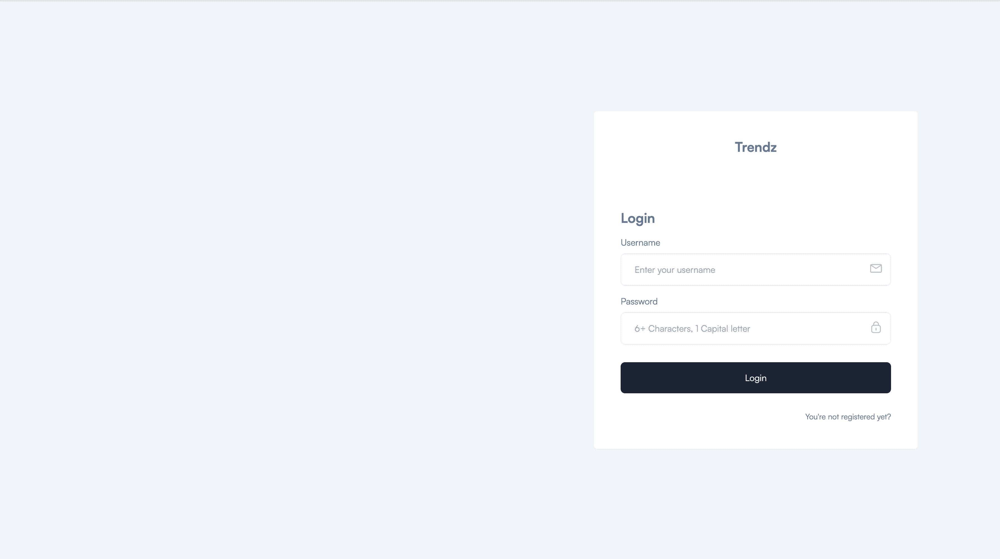
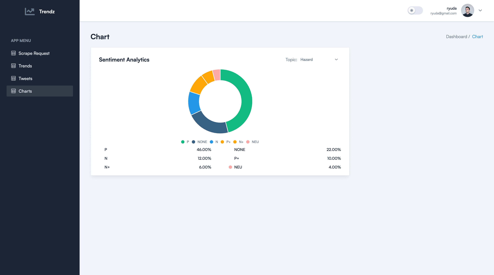
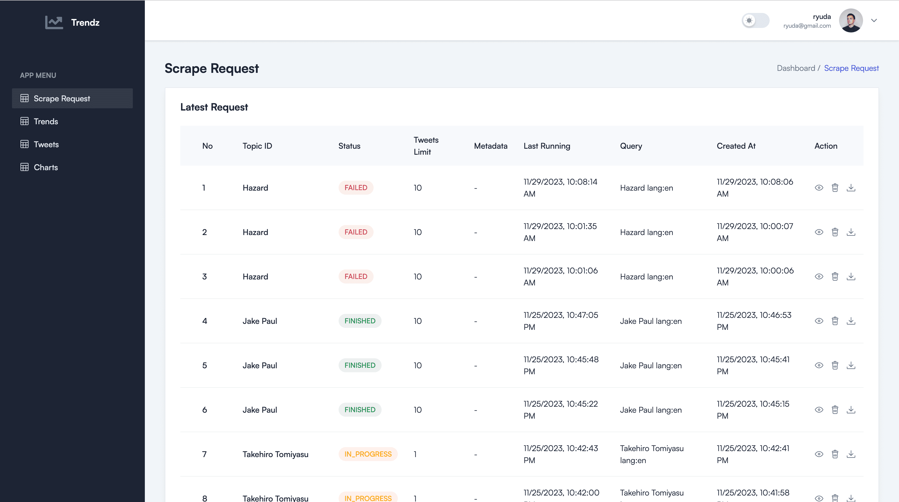

# **Trendz - Trending Sentiment App**

**Trendz** is a sentiment analysis dashboard designed to offer real-time insights into trending topics. Developed for ease of use, it provides a comprehensive view of sentiment metrics, empowering users to understand and explore the dynamics of ongoing conversations online.

## **Table of Contents**

- [Preview](#preview)
- [How To Deploy](#how-to-deploy)
- [Development Notes](#development-notes)
- [Requirements](#requirements)
- [Package Used](#package-used)

## **Preview**

## **How To Run Dev**
- Run : <code>npm install</code>
- Run : <code>npm run build</code>

## **How To Deploy**

- Git clone
- Don't forget for the env
- Run : <code>npm run build</code>

Default build output directory: /dist

## **Development Notes**

- > Built with vite react tailadmin boilerplate : [tailadmin](https://tailadmin.com/).

## **Requirements**

- Node.js 18+ and npm

## **Package Used**

| Package                 | Version    | Documentation                                          |
| ----------------------- | ---------- | ------------------------------------------------------ |
| apexcharts             | ^3.41.0    | [Documentation](https://www.npmjs.com/package/apexcharts) |
| axios                 | ^1.5.1      | [Documentation](https://www.npmjs.com/package/axios)     |
| headlessui            | ^0.0.0      | [Documentation](https://www.npmjs.com/package/headlessui)|
| jsvectormap           | ^1.5.3      | [Documentation](https://www.npmjs.com/package/jsvectormap)|
| match-sorter          | ^6.3.1      | [Documentation](https://www.npmjs.com/package/match-sorter)|
| react                 | ^18.2.0     | [Documentation](https://www.npmjs.com/package/react)     |
| react-apexcharts      | ^1.4.1      | [Documentation](https://www.npmjs.com/package/react-apexcharts)|
| react-dom             | ^18.2.0     | [Documentation](https://www.npmjs.com/package/react-dom)  |
| react-hot-toast       | ^2.4.1      | [Documentation](https://www.npmjs.com/package/react-hot-toast)|
| react-icons           | ^4.10.1     | [Documentation](https://www.npmjs.com/package/react-icons)|
| react-redux           | ^8.1.3      | [Documentation](https://www.npmjs.com/package/react-redux)|
| react-router-dom      | ^6.14.2     | [Documentation](https://www.npmjs.com/package/react-router-dom)|
| react-toastify        | ^9.1.3      | [Documentation](https://www.npmjs.com/package/react-toastify)|
| react-validation      | ^3.0.7      | [Documentation](https://www.npmjs.com/package/react-validation)|
| redux                 | ^4.2.1      | [Documentation](https://www.npmjs.com/package/redux)     |
| redux-devtools-extension | ^2.13.9   | [Documentation](https://www.npmjs.com/package/redux-devtools-extension)|
| redux-thunk           | ^2.4.2      | [Documentation](https://www.npmjs.com/package/redux-thunk)|
| sort-by               | ^0.0.2      | [Documentation](https://www.npmjs.com/package/sort-by)   |
